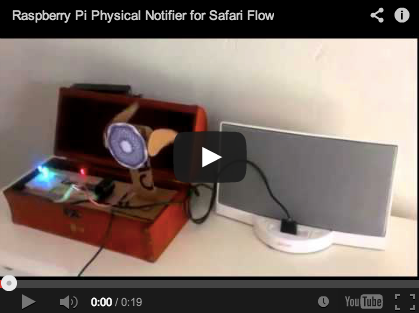
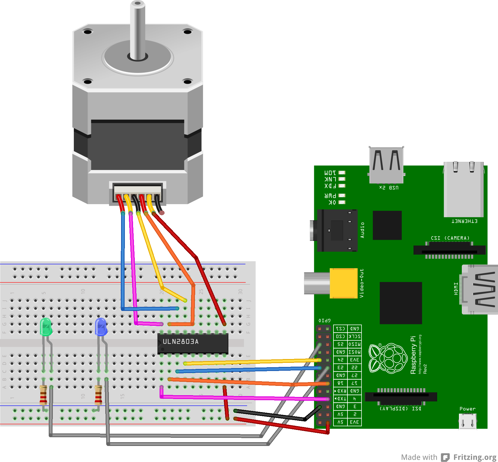

CHIRPY
=======
This Raspberry Pi project will check an email address which gets an email for each trial and subscription to our new product, codename "Heron"

If a new subscription is found, it will then play a bird sound, spin a spirograph, flap some bird wings and flash some LEDs.

[Sign up for a Free Trial!!](http://www.safariflow.com/register/)
---------------

1. Build Circuit
-----------------
  * [Raspberry Pi](http://www.adafruit.com/products/998)  
  * [Wi Fi Adapter](http://www.adafruit.com/products/814)  
  * [ULN2803 – Darlington Driver](http://www.google.com/url?q=http%3A%2F%2Fwww.adafruit.com%2Fproducts%2F970&sa=D&sntz=1&usg=AFQjCNFSWfAcPMut1_Cu25kFU3FKm-Of7g)  
  * [5v Unipolar Stepper Motor](http://www.adafruit.com/products/858)  
  * [Assorted LED & Resistors](http://www.google.com/url?q=http%3A%2F%2Fwww.amazon.com%2Fgp%2Fproduct%2FB004UZDKRG%2F&sa=D&sntz=1&usg=AFQjCNHuSzp6f3TkThrjQlBZToz5fdTsBg)  
  * [Solderless Breadboard](http://www.google.com/url?q=http%3A%2F%2Fwww.adafruit.com%2Fproducts%2F239&sa=D&sntz=1&usg=AFQjCNF-dFTd9g1eE89KUvQD0tbUWDmlvQ)  
  * [Jumper Wires](http://www.google.com/url?q=http%3A%2F%2Fwww.radioshack.com%2Fproduct%2Findex.jsp%3FproductId%3D2103801&sa=D&sntz=1&usg=AFQjCNERiEY1ZSEfRd1IFAuXFD2T8fVs3w)  
  * [Lego Bevel Gears](http://www.google.com/url?q=http%3A%2F%2Fwww.technicopedia.com%2Ffundamentals.html%23bevel&sa=D&sntz=1&usg=AFQjCNEF-CthSsvVTtvISe8DYL1l0lLJQQ) for wings & spiro (Borrowed mine from my sons Cement Mixer)  
  * [Powered Speakers]() Extra Points if you build this [Dirt Cheap Amp](http://www.safariflow.com/library/view/Snip%2C+Burn%2C+Solder%2C+Shred/9781593272593/ch12.html)  
  * Amazon Prime Box & creativity for the Bird 
  * Hot Glue Gun 

2. Setup Code:
------------
- Clone this repo directly to your Pi using [git-core](http://quick2wire.com/articles/a-gentle-guide-to-git-and-github/) or clone to your computer and copy over to your Pi ([NAS](http://www.raspberrypi.org/phpBB3/viewtopic.php?f=36&t=26826), [VSFTP](http://elinux.org/RPi_Noob_Guide_for_Wheezy_and_vsftpd#Installing_vsftpd_.26_Editing_the_vsftpd.conf_), or other...?
- Modify local.py.example to local.py and add your gmail credentials & Label you want to use to trigger Chirpy
- Optional: Add crontab entry (Sample provided with instructions in the comments) to run this code at a specific interval
- Optional: Create Google Spreadhseet to run gmailMarkReadMidnight.js at midnight (See comments in .js file for instructions)

3. Let 'er Rip!
----------------
- Send emails to your Account with unique Subjects that match the Label criteria you set up above for testing
- either run $ sudo python chirpy.py OR wait for the crontab to run and pick up the emails

Suggestions? Improvements? Let me know!
========================================

